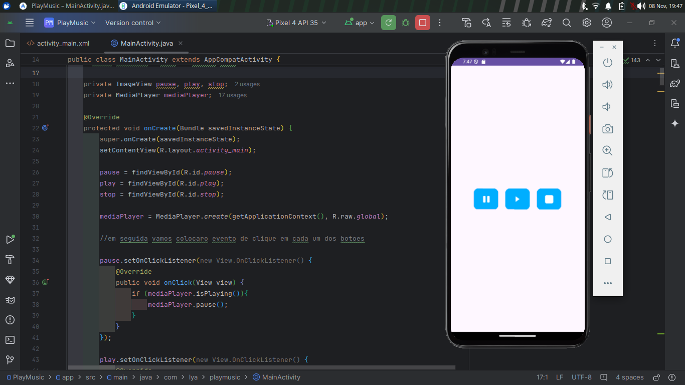

PlayMusic - Aplicativo de Reprodução de Música para Android

O PlayMusic é um aplicativo Android básico desenvolvido para reproduzir, pausar e parar músicas, utilizando o componente MediaPlayer do Android. Esse projeto explora o ciclo de vida de uma Activity para garantir uma experiência de reprodução suave e eficiente.
Principais Funcionalidades:

    Botões de Controle:
        Play: Inicia a reprodução da música se houver um arquivo de áudio carregado.
        Pause: Pausa a música se estiver tocando, permitindo retomar do ponto onde parou.
        Stop: Para a música e reinicializa o MediaPlayer para permitir uma nova execução desde o início.
    Gerenciamento de Ciclo de Vida:
        onStart: Reproduz a música automaticamente sempre que o app entra em primeiro plano, se o áudio estiver carregado.
        onStop: Pausa a música automaticamente quando o app é minimizado, permitindo que o usuário retome do ponto em que parou ao retornar ao app.
        onDestroy: Para a música, libera os recursos com release() e define o mediaPlayer como nulo, garantindo que nenhum recurso de áudio fique ativo após o fechamento do app.

Tecnologias e Conceitos Utilizados:

    MediaPlayer: Utilizado para manipular a reprodução de áudio, permitindo iniciar, pausar e parar o som.
    Ciclo de Vida da Activity: Integração dos métodos onStart, onStop e onDestroy para gerenciar a reprodução e liberar recursos automaticamente com base na visibilidade do app.
    Interface Simples e Intuitiva: Três botões (Play, Pause e Stop) permitem controlar facilmente a reprodução, garantindo uma experiência de usuário direta.

Este projeto demonstra o uso do MediaPlayer e a importância de gerenciar recursos corretamente no ciclo de vida de uma Activity, proporcionando uma boa base para desenvolvedores que desejam criar apps de áudio no Android.
